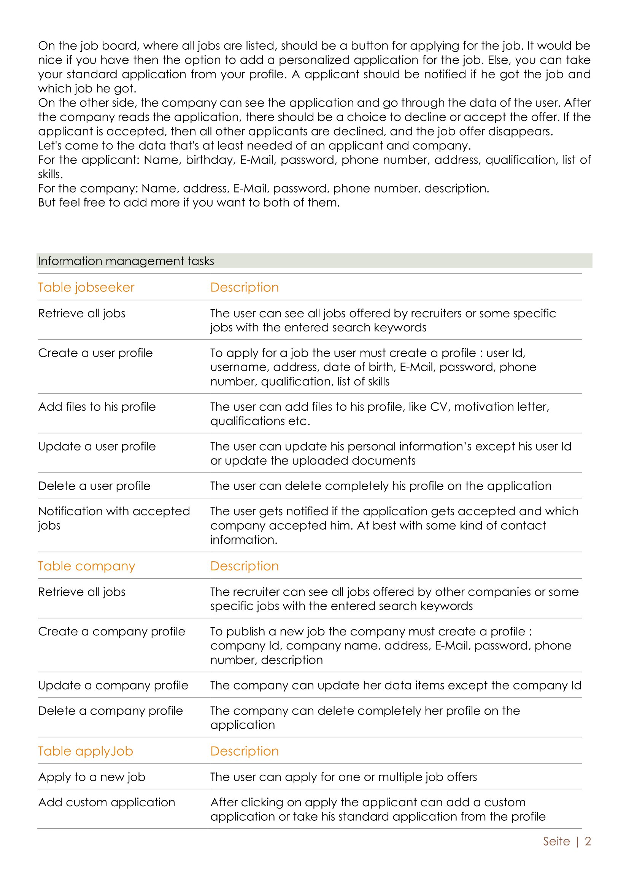
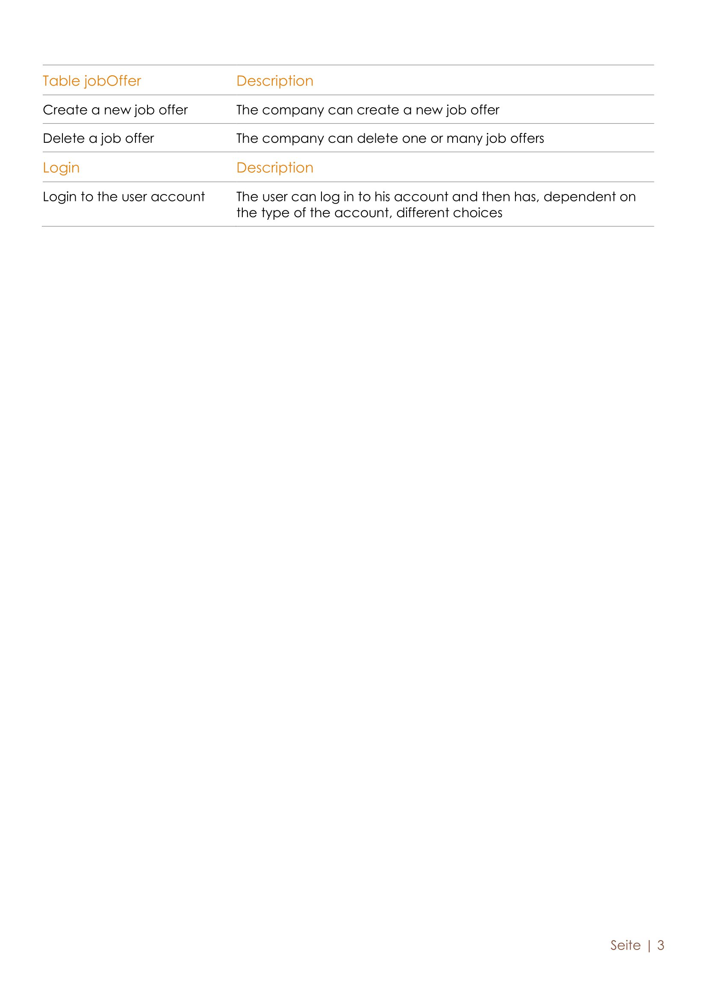

# Improvements from discussions
| Original | Refined |
|--------------------------------------------------------------------------------------------------------------------------------------------------------------------------------------------------------------------|--------------------------------------------------------------------------------------------------------------------------------------------------------------------------------------------------------------------|
| Retrieve all jobs: The user can see all jobs offered by recruiters or some specific jobs with the entered search keywords. | Retrieve all jobs: The user can see all jobs offered by recruiters or some specific jobs based on the entered search keywords. |
| Create a user profile: To apply for a job the user must create a profile : user Id, username, address, date of birth, E-Mail, password, phone number, qualification, list of skills. | Create a user profile: To apply for a job, the user must create a profile by entering their username, address, date of birth, email, password, phone number, qualification, and list of skills. A unique id will be generated automatically. |
| Add files to his profile: The user can add files to his profile, like CV, motivation letter, qualifications etc. | Add documents to profile: The user can add PDF documents to their profile, such as CV, motivation letter, qualifications etc. |
| Update a user profile: The user can update his personal information’s except his user Id or update the uploaded documents. | Update a user profile: Allow updating of all user data items except the user ID, including personal information and uploaded documents. |
| Delete a user profile: The user can delete completely his profile on the application. | Delete a user profile: The user can completely delete their profile from the application. |
| Notification with accepted jobs: The user gets notified if the application gets accepted and which company accepted him. At best with some kind of contact information. | Notification with accepted jobs: The user gets notified in-app/by email if their application gets accepted, identifying the accepting company, and providing company's contact information. |
| Retrieve all jobs: The recruiter can see all jobs offered by other companies or some specific jobs with the entered search keywords. | Retrieve all jobs: The recruiter can see all jobs offered by other companies or some specific jobs based on the entered search keywords. |
| Create a company profile: To publish a new job the company must create a profile : company Id, company name, address, E-Mail, password, phone number, description. | Create a company profile: To publish a new job, the company must create a profile by entering their name, address, email, password, phone number, and description. A unique id will be generated automatically. |
| Update a company profile: The company can update her data items except the company Id. | Update a company profile: Allow updating of all company data items except the company ID. |
| Delete a company profile: The company can delete completely her profile on the application. | Delete a company profile: The company can completely delete their profile from the application. |
| Apply to a new job: The user can apply for one or multiple job offers. | Apply to a new job: The user can apply for one or multiple job offers. |
| Add custom application: After clicking on apply the applicant can add a custom application or take his standard application from the profile. | Use filters: After retrieving jobs using search keywords, the applicant can use custom filters to narrow down the results. |
| Create a new job offer: The company can create a new job offer. | Create a new job offer: The company can create a new job offer. |
| Delete a job offer: The company can delete one or many job offers. | Delete a job offer: The company can delete one or multiple job offers. |
| Login to the user account: The user can log in to his account and then has, dependent on the type of the account, different choices. | Login to the user account: The user can log in to their account and, depending on the type of the account, has different options. |

# Additional improvements (within models)
- [x] Add the missing *Application* and *Job* classes as well as their attributes.
- [x] Add the *Document* class and its attributes to provide a way to store the documents such as CV, cover letter, etc.
- [x] Brainstorm over the job search functions and its UI.

# Division of work for Assignment 7B
- **Phong Vu Thanh - fontvu**: task 1
- **Ilia Karasev - ilia-karasev**: task 2 for User, Company, and Job classes
- **LamaIshan Lamal - ishanism**: task 2 for Application and Document classes

# Division of work for Assignment 7C-1
- **Phong Vu Thanh - fontvu**: delete function, html files for index, delete, and retrive functions
- **Ilia Karasev - ilia-karasev**: model class Job, retrieve and create functions
- **LamaIshan Lamal - ishanism**: update function, html files for update and create functions

